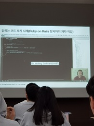

# 대경권 소프트웨어 특강

* 일시: 2018년 5월 12일 오후 12시 30분 ~ 5시 30분
* 장소: 경북대학교 IT융합산업빌딩 2층 대회의실
* 활동명: 2018년도 대경권 대학생 프로그래밍 경진대회에서의 SW 특강

SW 특강의 주요 내용은 첫 번째로 하나의 컴퓨터 언어만 아는 것보다는 다양한 컴퓨터 언어를 알고 상황에 따라 언어를 적절히 선택하여 지혜롭게 사용할 수 있는 역량이 필요하다고 하였다. 그러면 비슷한 사람들 사이에서 좀 더 경쟁력을 가질 수 있다고 하였다. 두 번째는 코드 다 짜고나서 코드가 얼마나 깔끔하게 표현하는지에 있는데, 주석을 여러 개 다는 것 보다는 변수의 이름을 자세하게, 명료하게 풀어 쓰는 것이 보기에 더 좋다고 말했다. Ruby on rails 창시자의 저자를 보여주면서 읽히는 코드를 어떻게 짜는 지에 대해서 알아보았다. 그리고 요즘에는 혼자서 코드를 작성하는 것은 무리가 되기에, 여러 명에서 협업하며 코드를 작성하는 것을 강조하였다. 이를 위해서는 쉽게 읽히는 코드를 만들 줄 알아야 한다는 것이 선행되어야 함을 조언해주었다.

어떻게 보면 특강의 내용이 당연할 지도 모르겠지만, 나에게는 꼭 필요했던 특강이었다. 이 특강을 듣기 전에는 변수 이름을 정하는 규칙에 대해서 생각해 보지 않았고, 그저 부르기 편한 변수 이름, 함수 이름을 썼었다. 그러다 보니 길이가 긴 코드를 작성할 때, 이해하기가 난잡하여 하루가 지난 뒤 다시 보면 내가 쓴 것임에도 불구하고 이해하기 힘들었다. 그런데 이번 특강을 통해서 코드에서 변수명을 짓는 규칙을 만들어보며 어떻게 하면 효율적으로 잘 읽히는 코드를 만들 수 있는지 고민해보게 되었다.
또한 융합에 대해서 중요하게 생각하게 되었다. 강연 내용을 생각해보면, C언어에 Python을 적절히 융합(이식)하여 빠르고 이해하기 쉬운 코드를 만들고, 사람과 사람이 함께 프로젝트를 만들어 멋진 결과물을 만들 수 있듯이, 어떤 것을 융합하여 만들면 좋은 효율을 낼 수 있다고 생각하는 계기가 되었다.
