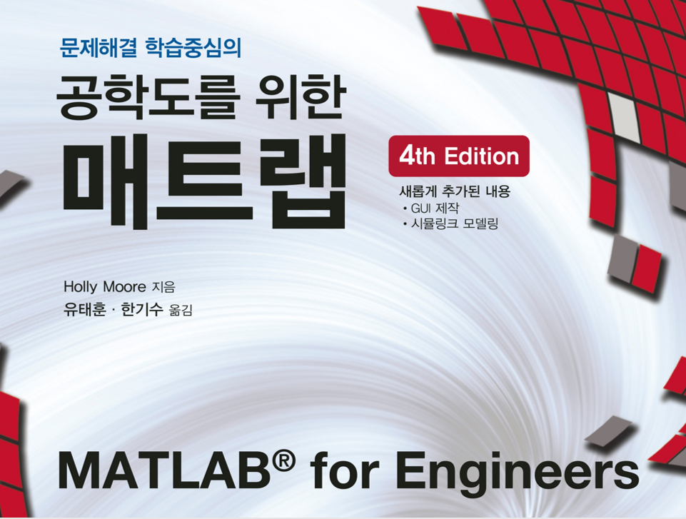

# 동계방학 Matlab 워크숍

* 일시: 2019년 1월 29일 9시 ~ 18시
* 장소: 경북대학교 IT2-114(컴퓨터실)
* 활동명: Matlab/Simulink 기본 사용법 및 응용

매트랩은 수치 계산, 특히 행렬을 사용하는 수학 계산에 사용되는 프로그래밍 언어이자, 하나의 도구이다. 매트랩을 통해 여러가지 복잡한 연산들을 빠르고 쉽게 할 수 있고, 방대한 라이브러리로 다양한 분야에 사용 및 응용할 수 있다. 이런 점으로 나중에는 여러가지 데이터 처리 및 연산, 시각화 등을 할 때 매트랩이 중요한 역할을 할 것이라 예상하여, 매트랩 워크숍에 참여하게 되었다.

매트랩은 python처럼 인터프리터 언어 형식을 가진다. 그래서 계산기처럼 여러가지를 입력하면 바로 출력하는 형태를 가지고 있다. 또한 매트랩은 이미 알고 있는 c언어나 python과 달리 행렬과 행렬과 관련된 연산이 잘 되어있었고. 2차원이나 3차원 그래프를 빠르게 그릴 수 있다. 매트랩 역시 제어문과 반목문이 있고 알고 있는 개념 그대로 매트랩 문법에 맞게 사용하면 된다.

그리고 simulink에 대해서 알아보았다. simulink은 내장된 다양한 블록을 사용하여 모델을 만들어 문제를 해결하는 그래픽기반의 대화형 프로그램이다. 신호처리 분야에서는 오래 전부터 사용하고 있다고 한다. GUI 환경을 통해 실제 시스템을 나타내는 모델을 쉽게 개발하고 동적 시스템을 모델링 및 해석하는데 좋다는 것을 알게 되었다.

매트랩 워크숍을 통해 비록 하루 안에 매트랩의 전부는 알지는 못했지만, 추가적인 학습이나 조사를 통해 매트랩의 기초를 완성시킬 수 있게 했다. 그래프 그리기나 데이터 시각화 등 당장 필요하고 기본적인 기능은 이미 파이썬에서 사람들이 만든 라이브러리랑 많이 겹쳐서 매트랩의 필요성을 조금 덜 받았다. (심지어 파이썬은 매트랩과 달리 오픈소스이다..!!) 그래도 매트랩의 압도적(그리고 매우 무거운 용량)인 라이브러리로 꼭 필요한 순간엔 쓸 수 있겠다 생각하여, 매트랩의 기본은 어느정도 숙지해야겠다고 생각했다.
